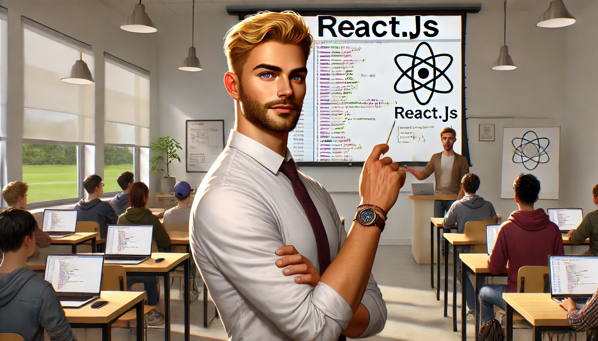

# Maha Mohamed Ahmed Mohamed

# React Quiz!



## Instructions

- `Fork` and `clone` this repository
- You will be answering the quiz questions below by editing this README with your answers
- Give the best explanation you can for each question in **your own words**
- React Docs: [here](https://react.dev/learn)

### 1. How do you create a React App from the terminal command line?

```
 npm create vite@latest .
```


### 2. If you clone a React App that has already been created, what command is needed to start developing with its dependencies?

```
 npm install
```


### 3. How do you start the in-browser development server for a React App?

```
 npm run dev
```


### 4. What folder in a React App should component files be created in?


### **src folder**


### 5. What is the syntax for a function based component?

```
function Name(props) {
  return (
    <main>
    </main>
  )
}
export default Name;
```

### 6. What direction are props passed in a React Component?


From the parent to the child


### 7. How is a React Component brought in to be accessed in another file?


using  **import**


### 8. How do we gain access to props in a child component?


Using props parameter or destructure props

